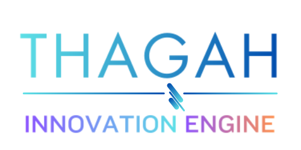

  

Welcome to the official GitHub repository of Thagah Innovation Engine.

This repository serves as the central hub and guiding framework for all Thagah Innovation Engine operations.

## Mission:

At **Thagah Innovation Engine**, we transcend the conventional bounds of learning and knowledge discovery. We are not here to simply play catch-up or gather spectator views of how things work—we exist to help you transform knowledge into action and possibility. Our mission is to deliver visionary, well-researched, and boundary-pushing insights that empower learners to build, innovate, and create meaningful impact from day one. Through actionable learning resources, practical and profitable strategies, and forward-looking ideas, we equip thinkers and creators to advance society, enhance well-being, and realize their full potential.

**Thagah Innovation Engine** is not just a learning home—it is a dynamic learning and research ecosystem designed to be a launchpad for ambitious minds ready to shape the future with what they know.

## Value Tracking

The following link provides access to the central Asset Tracker, which records all key resources and assets critical to Thagah Innovation Engine operations, as they are created. Each asset includes metadata such as creation date, creator, approver, and approval status.

- [**Value Track - Thagah Innovation Engine**](https://docs.google.com/spreadsheets/d/1-rxowyl-U3Tb_kPP4Vfyf9zuIzbybM8v3shDgMlzuzc/edit?usp=sharing)

## Operations Tracking

This section provides access to Games sheets, which track all moves, statuses, priorities, and progress for each game, organized by strategic grouping. These sheets serve as the central tool for planning, monitoring, and analyzing ongoing operations, enabling clear visibility of work in progress and completed tasks.

- [**Thagah Innovation Engine Games – Terra Fajr**](https://docs.google.com/spreadsheets/d/1CPR-034-GZ7VNd-W2ciGZRSVK_eToFj2aXojdHU4en4/edit?usp=sharing)

